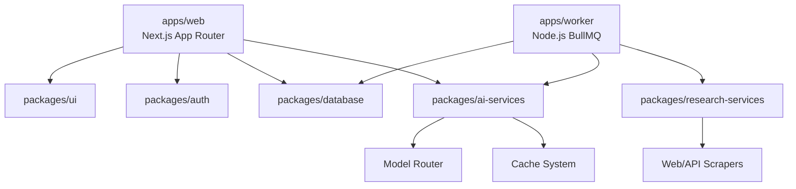

# Digireach SAGE AI - Enterprise Architecture Source of Truth

This document serves as the absolute source of truth for the entire **Digireach SAGE AI** application lifecycle. It incorporates the complete master specification (including the exhaustive **AI Research Engine**) and defines the scalable, long-term architectural solution required for an Enterprise AI Marketing Operating System capable of supporting millions of users.

## 1. Core Philosophy & Product Category
- **Category**: Enterprise AI Content Intelligence & Marketing Operating System
- **Workflow Pipeline**: `Research` → `Verify` → `Plan` → `SEO` → `Create` → `Publish` → `Analyze` → `Learn`
- **Rule of Thumb**: The AI must *never* generate content immediately. It must behave as a McKinsey Consultant → Research Scientist → Journalist → SEO Expert → Business Analyst → Content Strategist.
- **Trust Standard**: Never hallucinate. Never invent statistics, citations, case studies, or companies. Always verify and cite.

## 2. Infrastructure Architecture (Turborepo)

The repository uses a strictly modular feature-based architecture utilizing `pnpm` workspaces via Turborepo.

## 3. Database Philosophy & Multi-Tenancy

- **Isolation**: Tenant data is strictly isolated by `organizationId`. Users cross-accessing is impossible.
- **Identifiers**: Universally Unique Identifiers (UUIDs) for all primary keys.
- **Safety**: Hard deletes are forbidden. Soft delete records (`deletedAt`) everywhere.
- **Auditing**: Every critical write operation generates an `audit_log` entry.

### Research Engine Tables
The database includes the following highly relational tables:
- `research_projects`, `research_sessions`
- `research_sources`, `research_statistics`, `research_citations`
- `knowledge_nodes`, `knowledge_edges` (For the Knowledge Graph)
- `competitor_reports`, `news_articles`, `research_cache`

## 4. Intelligent AI Architecture & Research Engine

### The 10-Step Research Workflow
Every research query strictly follows this flow in background queues:
1. **Understand Intent**: Determine industry, audience, goal, and buying stage.
2. **Determine Depth**: Auto-select Quick, Standard, Deep, or Enterprise research.
3. **Create Research Plan**: Identify questions, competitors, and trends.
4. **Web Research**: Query official websites, gov sources, papers, Reddit, GitHub, Quora.
5. **Research Verification**: Cross-check claims; reject clickbait and AI-spam.
6. **Source Ranking**: Score based on Authority, Freshness, and Trust.
7. **Knowledge Extraction**: Extract facts, statistics, case studies, processes.
8. **Knowledge Graph**: Map nodes and relationships.
9. **Research Cache**: Store the final verified data.
10. **Generate Report**: Produce the final Executive Summary, ROI, and Action Plan.

### Multi-Layered Cache System & Token Optimization
To save tokens and improve speed, the system implements:
1. **Research Cache**: Saves scraped web pages and API results.
2. **Citation Cache**: Maps claims to verified URLs.
3. **Knowledge/Memory Cache**: Stores Brand Voice, Company Info, and User Preferences.
*The system will NEVER repeat expensive research.*

## 5. UI/UX & Marketing Design

- **Aesthetic**: Premium, minimal, dark/light mode, glassmorphism, high contrast, smooth subtle micro-animations.
- **Research Dashboard**: Source Manager, Citation Manager (APA, MLA, etc.), Research Queue, Knowledge Graph Visualizer, Competitor Analysis.
- **Performance**: Research runs entirely via Background Jobs. The UI tracks progress via streaming updates.

## 6. Implementation Dependency Order

1. **Foundation Setup**: Complete Turborepo, shared `ui`, and ESLint configurations. (Completed)
2. **Database Layer**: Build and migrate the Prisma multi-tenant schema including all Research tables. (Completed)
3. **Authentication Layer**: Wire NextAuth v5, create role matrices, build auth UI. (Completed)
4. **App Shell**: Build the workspace shell, sidebar, and command palette. (Completed)
5. **Core AI Services**: Implement the Model Router, Cache System, and Quality Gates. (Completed)
6. **Research Engine**: Build the BullMQ queue workers, web-scraping pipelines, and Citation Manager. (Completed)
7. **Content Studio**: Build the actual generation editors. (Completed)
8. **Background Processing**: Wire publishing and analytics ingestion. (Completed)
